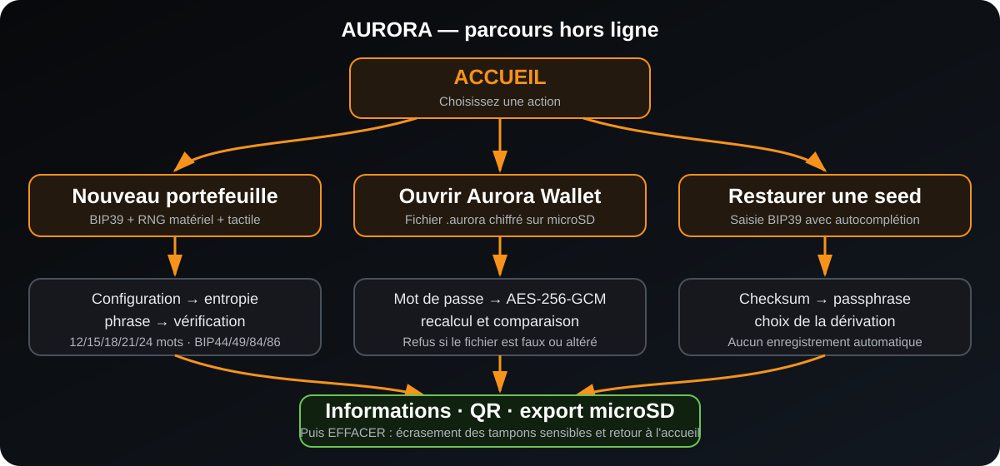

# AURORA Seed Generator

Firmware Bitcoin entièrement hors ligne pour **ESP32-2432S028(R)**, écran tactile ILI9341/XPT2046 de 320 × 240 pixels. Toute l’interface est en français ; seuls les mots de la phrase de récupération utilisent la liste anglaise officielle BIP39.


Version documentée : **1.7.5**
Environnement : **PlatformIO + Arduino**
Cible : **ESP32-2432S028R / Cheap Yellow Display**
Réseaux : **Wi-Fi et Bluetooth désactivés**

> [!CAUTION]
> AURORA est un projet expérimental à auditer avant tout usage avec de vrais fonds. Un ESP32 généraliste n’est pas un élément sécurisé et n’offre pas la résistance physique d’un portefeuille matériel certifié. Commencez avec des montants de test, comparez toujours les adresses avec un logiciel reconnu et ne photographiez jamais une seed ou une clé privée.

## Sommaire

- [À quoi sert AURORA ?](#à-quoi-sert-aurora-)
- [Ce qu’AURORA ne fait pas](#ce-quaurora-ne-fait-pas)
- [Fonctionnalités](#fonctionnalités)
- [Parcours de l’application](#parcours-de-lapplication)
- [Matériel nécessaire](#matériel-nécessaire)
- [Installation rapide avec Visual Studio Code](#installation-rapide-avec-visual-studio-code)
- [Compilation et flashage en ligne de commande](#compilation-et-flashage-en-ligne-de-commande)
- [Vérification SHA-256 du firmware](#vérification-sha-256-du-firmware)
- [Premier démarrage et autotest E00](#premier-démarrage-et-autotest-e00)
- [Utilisation détaillée](#utilisation-détaillée)
- [Types d’adresses et chemins](#types-dadresses-et-chemins)
- [Exports sur carte microSD](#exports-sur-carte-microsd)
- [Format chiffré Aurora Wallet](#format-chiffré-aurora-wallet)
- [Brochage et configuration matérielle](#brochage-et-configuration-matérielle)
- [Personnaliser les images](#personnaliser-les-images)
- [Sécurité et limites](#sécurité-et-limites)
- [Dépannage](#dépannage)
- [Arborescence du projet](#arborescence-du-projet)

## À quoi sert AURORA ?

AURORA transforme un ESP32-2432S028R en générateur et lecteur de portefeuille Bitcoin hors ligne. Il permet de :

- créer une phrase BIP39 anglaise de 12, 15, 18, 21 ou 24 mots ;
- ajouter une passphrase BIP39 optionnelle ;
- mélanger le générateur matériel de l’ESP32 avec des mouvements tactiles ;
- dériver une première adresse Bitcoin Mainnet selon BIP44, BIP49, BIP84 ou BIP86 ;
- vérifier que la phrase a bien été recopiée ;
- afficher l’adresse, la clé publique étendue du compte et leurs QR codes ;
- révéler volontairement la clé privée WIF, sur un écran rouge d’avertissement ;
- restaurer une seed existante avec autocomplétion BIP39 ;
- ouvrir une sauvegarde `.aurora` chiffrée depuis une carte microSD ;
- exporter un portefeuille vers un fichier Aurora Wallet chiffré ou un fichier Electrum privé ;
- effacer les tampons sensibles de la session avant de revenir à l’accueil.

## Ce qu’AURORA ne fait pas

AURORA :

- ne se connecte pas à Internet ;
- ne consulte pas le solde d’une adresse ;
- ne construit et ne signe pas de transaction ;
- ne diffuse aucune transaction ;
- ne remplace pas une sauvegarde physique durable de la seed ;
- ne protège pas contre une personne ayant un accès physique prolongé à l’appareil ;
- n’active pas automatiquement Secure Boot ni le chiffrement du flash ;
- ne garantit pas qu’un portefeuille tiers interprétera une WIF avec le même type de script.

La méthode recommandée consiste à utiliser AURORA hors ligne pour créer ou examiner les secrets, puis à utiliser uniquement une clé publique étendue ou un descripteur watch-only sur l’ordinateur connecté.

## Fonctionnalités

- Liste anglaise officielle BIP39 de 2 048 mots et contrôle du checksum.
- Toutes les combinaisons **12/15/18/21/24 mots × Legacy/Nested SegWit/Native SegWit/Taproot**.
- Passphrase BIP39 ASCII optionnelle, de 0 à 63 caractères imprimables.
- Entropie tactile : coordonnées, pression et timings de 160 échantillons.
- RNG matériel ESP32 activé explicitement autour de `esp_random()`.
- Mélange final RNG + tactile par SHA-256 avant création BIP39.
- Dérivations Bitcoin Mainnet BIP44, BIP49, BIP84 et BIP86.
- Affichage de huit mots maximum par page.
- Vérification de trois positions différentes tirées aléatoirement.
- Suggestions BIP39 pendant la restauration et la vérification de sauvegarde.
- Clé publique étendue de compte : `xpub`, `ypub` ou `zpub` selon le type.
- QR de l’adresse, de la clé publique étendue et de la WIF privée brute.
- Export microSD FAT32.
- Conteneur Aurora Wallet authentifié par AES-256-GCM.
- Autotest cryptographique bloquant au démarrage.
- Effacement anti-optimisation des principaux buffers applicatifs et graphiques.
- Aucune écriture volontaire de seed dans NVS, SPIFFS ou LittleFS.

La cryptographie Bitcoin repose principalement sur [uBitcoin](https://github.com/micro-bitcoin/uBitcoin), épinglé au commit `877542fdc16319dd92a7d2a679ea9dacce474bd2`, sur trezor-crypto inclus par cette bibliothèque et sur mbedTLS fourni par l’environnement ESP32. Le script `tools/patch_ubitcoin.py` applique les corrections et renforcements RAM attendus ; la compilation s’arrête si la dépendance ne correspond plus aux motifs contrôlés.

## Parcours de l’application



L’accueil présente trois choix :

1. **NOUVEAU PORTEFEUILLE** : création complète avec RNG matériel et entropie tactile.
2. **OUVRIR AURORA WALLET** : lecture d’un fichier `.aurora` chiffré présent à la racine de la microSD.
3. **RESTAURER UNE SEED** : saisie manuelle d’une phrase existante, avec autocomplétion.

Le logo blanc utilisé sur cette page est également conservé dans le projet :


## Matériel nécessaire

- une carte **ESP32-2432S028R** avec écran ILI9341 2,8 pouces et dalle XPT2046 ;
- un câble USB capable de transférer les données, pas uniquement de charger ;
- un ordinateur Windows, macOS ou Linux ;
- Visual Studio Code + PlatformIO, ou PlatformIO Core en ligne de commande ;
- facultatif : une carte microSD formatée en FAT32 pour les sauvegardes ;
- idéalement : un ordinateur hors ligne ou une machine dédiée pour la génération finale.

Selon la révision de la carte, Windows peut demander le pilote du convertisseur USB-série, généralement CH340 ou CP210x. Vérifiez le composant présent sur votre propre carte avant d’installer un pilote.

## Installation rapide avec Visual Studio Code

### 1. Installer les outils

1. Installez [Visual Studio Code](https://code.visualstudio.com/).
2. Ouvrez l’onglet **Extensions**.
3. Recherchez et installez **PlatformIO IDE**.
4. Redémarrez Visual Studio Code si l’extension le demande.

### 2. Ouvrir le projet

1. Téléchargez ou copiez le dossier complet AURORA.
2. Dans Visual Studio Code, choisissez **Fichier > Ouvrir un dossier**.
3. Sélectionnez le dossier qui contient `platformio.ini`, `src/`, `include/` et `assets/`.
4. Attendez la fin de l’installation automatique de la plateforme et des bibliothèques.

Ne copiez pas uniquement `src/main.cpp` dans un projet Arduino vide : le firmware dépend de la configuration PlatformIO, des polices, des images, des scripts de durcissement et des versions épinglées.

### 3. Brancher l’ESP32

1. Branchez l’ESP32 avec un câble USB de données.
2. Dans PlatformIO, ouvrez **Devices** pour identifier le port série.
3. Sous Windows, le port ressemble à `COM3` ou `COM5`.
4. Sous Linux, il ressemble souvent à `/dev/ttyUSB0` ou `/dev/ttyACM0`.
5. Sous macOS, il ressemble souvent à `/dev/cu.usbserial-...`.

### 4. Compiler

Cliquez sur l’icône **✓ Build** de PlatformIO. La fin du journal doit contenir :

```text
========================= [SUCCESS] =========================
```

L’avertissement TFT_eSPI indiquant que `TOUCH_CS` n’est pas défini est normal : AURORA utilise directement la bibliothèque XPT2046 avec les broches de `include/board_config.h`.

### 5. Flasher

Cliquez sur **→ Upload**. PlatformIO compile si nécessaire, détecte le port et programme les quatre zones nécessaires : bootloader, partitions, boot application et firmware.

Un flashage réussi se termine par :

```text
Hash of data verified.
Leaving...
Hard resetting via RTS pin...
========================= [SUCCESS] =========================
```

### 6. Vérifier le démarrage

Ouvrez **Serial Monitor** à `115200` bauds. Le résultat attendu est :

```text
AURORA autotest : E00
AURORA autotest durée : environ 2 secondes
```

Fermez ensuite le moniteur série avant toute nouvelle commande de flashage, car un port déjà ouvert peut empêcher PlatformIO d’utiliser la carte.

## Compilation et flashage en ligne de commande

Placez-vous dans le dossier contenant `platformio.ini`.

### Vérifier PlatformIO

```text
pio --version
pio device list
```

### Compiler

```text
pio run -e esp32-2432S028R
```

Le binaire principal est créé ici :

```text
.pio/build/esp32-2432S028R/firmware.bin
```

### Flasher en indiquant le port

Windows :

```text
pio run -e esp32-2432S028R --target upload --upload-port COM3
```

Linux :

```text
pio run -e esp32-2432S028R --target upload --upload-port /dev/ttyUSB0
```

macOS :

```text
pio run -e esp32-2432S028R --target upload --upload-port /dev/cu.usbserial-XXXX
```

### Lire l’autotest

```text
pio device monitor --port COM3 --baud 115200
```

Quittez le moniteur avec `Ctrl+C`.

### Installation depuis un seul `firmware.bin`

La méthode recommandée reste **PlatformIO Upload**, surtout sur une carte neuve. Le fichier `firmware.bin` seul correspond uniquement à la partition applicative située à l’adresse `0x10000`. Une carte totalement vierge a également besoin du bootloader, de la table de partitions et de `boot_app0`.

Sur une carte déjà initialisée avec exactement le même environnement AURORA, un utilisateur avancé peut mettre à jour uniquement l’application à `0x10000`. Ne changez jamais cette adresse sans vérifier `platformio.ini` et la table de partitions. PlatformIO évite ces erreurs et effectue automatiquement les vérifications de hash pendant l’écriture.

## Vérification SHA-256 du firmware

SHA-256 permet de vérifier que le fichier n’a pas changé entre sa création, son téléchargement et son flashage. Il ne prouve l’authenticité que si la valeur de référence a été obtenue par un canal de confiance.

### Empreinte de la version 1.7.5 compilée et flashée

Fichier : `.pio/build/esp32-2432S028R/firmware.bin`
Taille : **1 477 216 octets**
SHA-256 :

```text
BA275C95507A713335A15C2452D5AE47F70D95F077F3F624F93A96F83BEB6BF4
```

### Windows PowerShell

```powershell
Get-FileHash -Algorithm SHA256 .\.pio\build\esp32-2432S028R\firmware.bin
```

Pour obtenir uniquement la valeur :

```powershell
(Get-FileHash -Algorithm SHA256 .\.pio\build\esp32-2432S028R\firmware.bin).Hash
```

### Linux

```bash
sha256sum .pio/build/esp32-2432S028R/firmware.bin
```

### macOS

```bash
shasum -a 256 .pio/build/esp32-2432S028R/firmware.bin
```

La casse des lettres n’a pas d’importance, mais les 64 caractères hexadécimaux doivent être identiques. Si l’empreinte diffère :

1. ne flashez pas le fichier ;
2. vérifiez que vous utilisez bien la version 1.7.5 ;
3. retéléchargez ou recompilez depuis les sources attendues ;
4. contrôlez `platformio.ini` et la liste des dépendances ;
5. générez et archivez une nouvelle empreinte si vous avez volontairement modifié le code.

Une recompilation après modification du code, des images, des options ou des dépendances produit normalement un autre SHA-256. Archivez ensemble le binaire, son SHA-256, la version du code et la sortie de :

```text
pio pkg list -e esp32-2432S028R
```

## Premier démarrage et autotest E00

Au démarrage, AURORA affiche le splash et lance en arrière-plan un autotest bloquant. Le bouton **CONTINUER** devient utilisable après la fin du contrôle.

`E00` signifie que tous les contrôles intégrés ont réussi. Toute autre valeur affiche **ÉCHEC DE SÉCURITÉ** et empêche la génération.

| Code | Contrôle concerné |
|---:|---|
| E00 | Tous les tests ont réussi |
| E01 | Clé maître BIP32 |
| E02 | Seed BIP39 connue |
| E03 | Checksum de descripteur BIP380 |
| E04 | Recherche et autocomplétion BIP39 |
| E05 | Encodage/décodage WIF et correspondance d’adresse |
| E10 à E14 | Construction Legacy/BIP44 |
| E20 à E24 | Construction Nested SegWit/BIP49 |
| E30 à E34 | Construction Native SegWit/BIP84 |
| E40 à E44 | Construction Taproot/BIP86 |
| E51 à E55 | Génération des phrases de 12 à 24 mots |
| E60 | PBKDF2-HMAC-SHA-256 et AES-256-GCM Aurora Wallet |

Si le code n’est pas `E00`, ne créez pas de portefeuille et notez le code exact.

## Utilisation détaillée

### Nouveau portefeuille : pages 1 à 7

#### 1/7 — Configuration du portefeuille

- Choisissez 12, 15, 18, 21 ou 24 mots.
- Choisissez Legacy, Nested SegWit, Native SegWit ou Taproot.
- Le réseau est toujours **Bitcoin Mainnet**.

Le nombre de mots détermine la quantité d’entropie BIP39, pas le format de l’adresse. Toutes les combinaisons proposées sont valides.

#### 2/7 — Passphrase BIP39

La passphrase est facultative. Elle est parfois appelée « 25e mot », mais ce n’est pas nécessairement un mot de la liste BIP39.

> [!WARNING]
> Une passphrase différente, même d’un seul caractère, crée un portefeuille totalement différent sans message d’erreur. Une passphrase oubliée rend les fonds associés irrécupérables.

La passphrase BIP39 n’est pas le mot de passe du fichier Aurora Wallet :

- **passphrase BIP39** : participe à la dérivation des clés Bitcoin ;
- **mot de passe Aurora Wallet** : chiffre uniquement le fichier `.aurora` sur la microSD.

#### 3/7 — Collecte d’entropie

Tracez des mouvements irréguliers jusqu’à 100 %. Pour chaque échantillon, AURORA mélange :

- les coordonnées X/Y ;
- la pression tactile ;
- le compteur en microsecondes ;
- une valeur provenant du RNG matériel ESP32.

Après 160 échantillons, le mélange tactile est condensé par SHA-256. Lors de la création BIP39, 32 nouveaux octets du RNG matériel sont mélangés avec ce résultat, puis condensés une seconde fois.

#### 4/7 — Phrase de récupération

- Recopiez les mots dans l’ordre exact.
- AURORA affiche au maximum huit mots par page.
- Utilisez **SUIVANT** et **PRÉCÉDENT** pour parcourir les pages.
- Ne photographiez jamais l’écran.
- Ne stockez jamais la phrase dans un service cloud ou une messagerie.

#### 5/7 — Vérification de sauvegarde

AURORA choisit trois positions différentes avec le RNG matériel. Tapez les premières lettres ; les suggestions BIP39 apparaissent au-dessus du clavier. Toucher une proposition recopie exactement le mot et passe au champ suivant. Un préfixe n’est complété automatiquement que s’il ne correspond plus qu’à un seul mot BIP39.

Les positions sont retirées aléatoirement à chaque nouveau passage sur l’écran.

#### 6/7 — Informations et QR codes

L’écran affiche :

- la première adresse de réception ;
- le chemin complet `m/purpose'/0'/0'/0/0` ;
- la clé publique étendue du compte ;
- les QR de l’adresse et de la clé publique étendue.

La clé privée n’apparaît qu’après une action volontaire sur **CLÉ PRIVÉE**. Le QR privé contient une WIF Base58Check brute commençant normalement par `K` ou `L`. Il ne doit contenir ni `wpkh(`, ni parenthèses, ni `#checksum`.

> [!IMPORTANT]
> Une WIF ne contient pas le type d’adresse. Après un import dans BlueWallet ou un autre logiciel, comparez l’adresse obtenue avec celle affichée par AURORA avant de recevoir des fonds. Pour conserver sans ambiguïté le chemin et le type de script, préférez une restauration BIP39 complète ou une importation de clé étendue/descripteur adaptée.

#### 7/7 — Sauvegarde et effacement

Vous pouvez exporter sur microSD, puis utiliser **EFFACER**. Cette action écrase les principaux buffers de la session et revient à l’accueil. Couper brutalement l’alimentation ne remplace pas l’action **EFFACER**.

### Ouvrir un Aurora Wallet

1. Formatez une microSD en FAT32.
2. Copiez les fichiers `.aurora` à la racine de la carte.
3. Insérez la carte avant de choisir **OUVRIR AURORA WALLET**.
4. Sélectionnez un fichier dans la liste déroulante.
5. Utilisez **ACTUALISER** si la carte a été insérée après l’ouverture de la page.
6. Saisissez le mot de passe du fichier.
7. Patientez pendant PBKDF2 et AES-GCM, environ 15 secondes sur la carte testée.

Après déchiffrement, AURORA ne fait pas confiance aux valeurs enregistrées. Il valide la phrase BIP39, recalcule le portefeuille depuis les mots et la passphrase, puis compare l’adresse, le chemin, les clés étendues, la WIF et le descripteur. Une différence, un mauvais mot de passe ou un fichier modifié provoque un refus.

Si le fichier contient une passphrase BIP39, elle est révélée sur un écran d’avertissement séparé après les mots.

### Restaurer une seed

1. Choisissez le nombre de mots.
2. Saisissez chaque mot anglais séparément.
3. Touchez une des trois suggestions pour éviter les fautes.
4. AURORA refuse la phrase si le checksum BIP39 est invalide.
5. Saisissez la passphrase BIP39 éventuelle.
6. Sélectionnez le type de dérivation dans la liste.
7. Comparez l’adresse et utilisez les QR.
8. Utilisez **EXPORTER** pour sauvegarder le portefeuille restauré.

La restauration manuelle ne sauvegarde rien automatiquement.

## Types d’adresses et chemins

| Choix AURORA | Standard | Première adresse | Clé étendue affichée | Adresse typique |
|---|---|---|---|---|
| Legacy | BIP44 / P2PKH | `m/44'/0'/0'/0/0` | `xpub` du compte `m/44'/0'/0'` | commence par `1` |
| Nested SegWit | BIP49 / P2SH-P2WPKH | `m/49'/0'/0'/0/0` | `ypub` du compte `m/49'/0'/0'` | commence par `3` |
| Native SegWit | BIP84 / P2WPKH | `m/84'/0'/0'/0/0` | `zpub` du compte `m/84'/0'/0'` | commence par `bc1q` |
| Taproot | BIP86 / P2TR | `m/86'/0'/0'/0/0` | `xpub` du compte `m/86'/0'/0'` | commence par `bc1p` |

Le descripteur watch-only utilise la clé publique étendue BIP32 standard et l’origine de clé complète, même lorsque l’interface présente un `ypub` ou `zpub` SLIP-132.

## Exports sur carte microSD

La microSD doit être en FAT32. Les noms acceptent les lettres, chiffres, `_` et `-`, avec 24 caractères maximum. AURORA ajoute l’extension et refuse d’écraser un fichier existant.

| Choix | Nom obtenu | Contenu | Risque principal |
|---|---|---|---|
| Aurora Wallet chiffré | `mon_nom.aurora` | seed, passphrase éventuelle, adresse, chemin, xpub, xprv, WIF et descripteur | le mot de passe permet de tout déchiffrer |
| Electrum privé non chiffré | `mon_nom-electrum.json` | `xpub` et `xprv` du compte dans une structure Electrum | toute personne possédant le fichier peut dépenser les fonds |

L’export Electrum est désactivé pour Taproot/BIP86. Les exports Sparrow natif, Specter et Bitcoin Core ne sont pas proposés.

Le JSON Electrum contient notamment :

```json
{
  "keystore": {
    "xpub": "clé publique étendue du compte",
    "xprv": "clé privée étendue du compte",
    "type": "bip32",
    "pw_hash_version": 1
  },
  "wallet_type": "standard",
  "use_encryption": false,
  "seed_type": "bip39"
}
```

Ce fichier est volontairement non chiffré. Ne l’utilisez pas pour une démonstration publique et ne le laissez pas sur la carte après import.

## Format chiffré Aurora Wallet

Le conteneur binaire `.aurora`, version 1, utilise :

- AES-256-GCM ;
- une clé AES de 256 bits ;
- un tag d’authentification de 128 bits ;
- PBKDF2-HMAC-SHA-256 avec 120 000 itérations ;
- un sel aléatoire de 128 bits ;
- un nonce aléatoire de 96 bits ;
- les paramètres d’en-tête comme données authentifiées ;
- un mot de passe ASCII de 12 à 63 caractères, saisi deux fois à la création.

Le contenu chiffré comprend les mots BIP39, la passphrase éventuelle, le type d’adresse, le chemin, l’adresse, la clé publique étendue, la clé privée étendue, la WIF, le descripteur et la version du firmware.

AES-256 ne rend pas un mot de passe faible équivalent à une clé aléatoire de 256 bits. Utilisez une phrase de passe longue, unique et conservée séparément. Il n’existe ni porte dérobée ni récupération en cas de perte.

Après lecture ou écriture, AURORA écrase le mot de passe du fichier, la clé AES, le texte clair et les principaux temporaires. Le fichier reste néanmoins une sauvegarde complète : mot de passe compromis = secrets compromis.

## Brochage et configuration matérielle

### Brochage par défaut

| Fonction | GPIO |
|---|---:|
| TFT MOSI | 13 |
| TFT MISO | 12 |
| TFT SCLK | 14 |
| TFT CS | 15 |
| TFT DC | 2 |
| TFT RST | -1 |
| Rétroéclairage | 21 |
| Touch MOSI | 32 |
| Touch MISO | 39 |
| Touch CLK | 25 |
| Touch CS | 33 |
| Touch IRQ | 36 |
| microSD MOSI | 23 |
| microSD MISO | 19 |
| microSD CLK | 18 |
| microSD CS | 5 |

Les paramètres TFT se trouvent dans `platformio.ini`. Le tactile, la microSD, la rotation et la calibration se trouvent dans `include/board_config.h`.

Configuration actuelle :

```text
Écran logique : 320 × 240
Rotation TFT : 1
Touch swap XY : 1
Touch inversion X : 0
Touch inversion Y : 1
Fréquence TFT : 40 MHz
Fréquence microSD : 10 MHz
```

Certains clones sans suffixe `R` utilisent un câblage ou une orientation différents. Modifiez uniquement les définitions concernées, recompilez, puis vérifiez toutes les zones tactiles avant de générer une seed.

## Personnaliser les images

### Splash

L’image source utilisée au démarrage est `assets/splash_320x240.png`. Pour la remplacer :

```text
python tools/make_splash_asset.py chemin/vers/nouvelle_image.png
pio run
```

Le script recadre en 4:3, redimensionne en 320 × 240 et régénère `src/assets/splash_img.c` au format RGB565. Le bouton, le titre et la version restent dessinés par LVGL.

### Logo de l’accueil

Le logo blanc est `assets/bitcoin_logo_112x160.png`. Pour le régénérer après modification de la source :

```text
python tools/make_bitcoin_logo_asset.py
pio run
```

Ne modifiez pas directement les grands tableaux C générés si l’image PNG source peut être mise à jour proprement.

## Sécurité et limites

### Réseaux

Au démarrage, le firmware coupe le Wi-Fi et le Bluetooth. Il n’efface pas les identifiants éventuellement présents en NVS afin d’éviter une écriture flash supplémentaire, mais il ne les utilise pas.

### RNG

Sur l’ESP32 original, `esp_random()` n’est considéré comme une source matérielle complète que lorsqu’une source d’entropie est active. AURORA active explicitement la source interne SAR-ADC avec `bootloader_random_enable()`, collecte les valeurs, puis la désactive.

### Mémoire

Les secrets doivent nécessairement exister en RAM pendant la dérivation et l’affichage. AURORA écrase explicitement ses buffers, les textes LVGL sensibles, les contextes cryptographiques principaux et plusieurs temporaires uBitcoin. Cela ne garantit pas l’effacement après un crash, une coupure brutale, une attaque DMA ou une analyse physique.

### Flash

La seed et les clés privées ne sont pas volontairement persistées dans le flash. Secure Boot et Flash Encryption ne sont pas activés automatiquement, car leur provisioning peut écrire des eFuses irréversibles. Sans ces protections, une personne ayant accès au matériel peut remplacer le firmware par une version malveillante.

### Écran et QR codes

Tout secret affiché peut être photographié ou observé. Le QR de clé privée doit être considéré comme aussi sensible que la seed. Une clé WIF seule est ambiguë sur le type de script ; vérifiez toujours l’adresse résultante.

### Carte microSD

- Le fichier `.aurora` est chiffré mais contient une sauvegarde complète.
- Le fichier Electrum contient une clé privée étendue en clair.
- Une suppression normale sur ordinateur n’efface pas nécessairement physiquement les cellules de la carte.
- Utilisez une carte dédiée et conservez-la hors ligne.

### Cérémonie recommandée avant de recevoir des fonds

1. Compiler depuis une machine de confiance.
2. Vérifier le SHA-256 du binaire.
3. Contrôler `E00` au démarrage.
4. Générer un portefeuille de test sans fonds.
5. Restaurer la même seed sur un portefeuille reconnu et hors ligne.
6. Comparer l’adresse Legacy, Nested SegWit, Native SegWit ou Taproot choisie.
7. Effacer la session AURORA.
8. Refaire la procédure avec la seed finale sur une machine isolée.
9. Envoyer d’abord un très petit montant et vérifier sa récupération.

## Dépannage

| Problème | Vérifications et solution |
|---|---|
| Aucun port série | Essayez un câble de données, un autre port USB et le pilote adapté au convertisseur USB-série |
| `Failed to connect` | Fermez le moniteur série, rebranchez la carte, recommencez l’upload ; utilisez le mode BOOT uniquement si votre révision le nécessite |
| Écran noir | Vérifiez l’alimentation, le rétroéclairage GPIO21, les broches TFT et le pilote `ILI9341_2_DRIVER` |
| Écran tourné ou tronqué | Vérifiez `AURORA_TFT_ROTATION`, `TFT_WIDTH` et `TFT_HEIGHT` |
| Toucher inversé ou décalé | Ajustez `AURORA_TOUCH_SWAP_XY`, `AURORA_TOUCH_INVERT_X/Y` et les valeurs MIN/MAX |
| Collecte bloquée avant 100 % | Faites des mouvements continus avec une pression suffisante et vérifiez le tactile dans le moniteur série |
| Rien après 100 % | Attendez le changement d’écran ; si nécessaire, redémarrez et vérifiez que l’autotest affiche E00 |
| Suggestions incorrectes | Vérifiez que le mot est anglais et appartient à BIP39 ; la version doit être au moins 1.7.5 |
| microSD absente | Reformatez en FAT32, réinsérez avant l’ouverture de la page et utilisez **ACTUALISER** |
| Fichier déjà existant | Choisissez un autre nom ; AURORA refuse volontairement l’écrasement |
| Mauvais mot de passe `.aurora` | Vérifiez casse, espaces et caractères ; le fichier ne possède aucune procédure de récupération |
| BlueWallet indique `Non-base58 character` | Le QR privé doit commencer par `K` ou `L` et ne contenir que la WIF brute ; utilisez la version 1.7.5 et comparez ensuite l’adresse |
| Échec de sécurité E01–E60 | Ne générez rien ; notez le code, recompilez avec les dépendances épinglées et contrôlez le matériel |

## Dépendances épinglées

| Composant | Version ou révision |
|---|---|
| Plateforme PlatformIO Espressif32 | `6.9.0` |
| LVGL | `8.4.0` |
| TFT_eSPI | `2.5.43` |
| XPT2046_Touchscreen | commit `f956c5d8ce3bf39169c7378416b89e7cfe70a034` |
| uBitcoin | commit `877542fdc16319dd92a7d2a679ea9dacce474bd2` |

Ne mettez pas ces dépendances à jour sans relancer les vecteurs de test, examiner les changements cryptographiques et vérifier que `tools/patch_ubitcoin.py` s’applique toujours exactement.

## Arborescence du projet

```text
assets/
  splash_320x240.png           Image du splash
  bitcoin_logo_112x160.png     Logo blanc de l’accueil
  aurora_workflow.svg          Schéma utilisé dans ce README
include/
  board_config.h               Brochage, rotation et calibration
  version.h                    Version affichée sur le splash
  secure_memory.h              Effacement anti-optimisation
  hardware_rng.h               Activation de la source RNG ESP32
  entropy.h                    Accumulation tactile et SHA-256
  wallet.h                     Interface du moteur Bitcoin
  sd_export.h                  Types d’export et lecture Aurora Wallet
  ui.h                         État et parcours LVGL
src/
  main.cpp                     Initialisation écran, tactile et radios
  wallet.cpp                   BIP39, BIP32, adresses et autotests
  sd_export.cpp                Electrum et conteneur Aurora Wallet
  ui.cpp                       Interface française
  assets/                      Images et polices converties en C
tools/
  patch_ubitcoin.py            Durcissement reproductible de uBitcoin
  make_splash_asset.py         Conversion du splash
  make_bitcoin_logo_asset.py   Conversion du logo
platformio.ini                 Cible, dépendances et broches TFT
README.md                      Ce guide
```

## Licence

Code AURORA : MIT. Les bibliothèques et outils tiers conservent leurs licences respectives.
